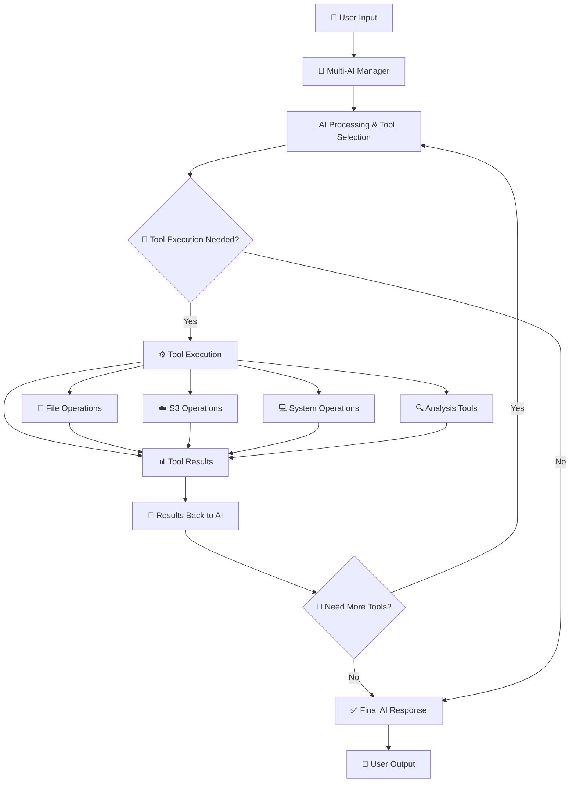

# IdSiberAi-CLI: Intelligent Multi-AI Command Line Interface

[](https://opensource.org/licenses/MIT)
[](https://nodejs.org/)
[](./docs/AI_PROVIDERS.md)

> 🤖 **AI-Powered CLI** that integrates multiple AI providers with powerful local system management tools.

## ✨ Features

- 🤖 **Multi-AI Support** - DeepSeek, OpenAI, Claude, Grok, ZhiPuAI, QwenAI, Gemini
- 🔄 **Provider Switching** - Switch AI providers on the fly
- 🛡️ **Auto Fallback** - Automatic provider switching on failures
- 🌐 **Dual Interface** - Choose between CLI and Web interfaces
- 📂 **Directory Navigation** - Visual directory browser & flexible path handling
- ☁️ **Cloud Storage** - Integrated S3 operations (AWS SDK v3)
- 🗄️ **Database Operations** - MySQL, PostgreSQL, SQLite database management
- 🛠️ **25+ Tools** - File ops, analysis, system automation, S3, database
- 📊 **Smart Analysis** - Language-aware code structure analysis
- 🌊 **Real-time Streaming** - Live response generation
- 📝 **Comprehensive Logging** - Track all operations and performance
- 🔒 **Secure Operations** - Sandboxed working directory
- 💬 **Natural Language** - Chat interface for any computing task

## 🚀 Quick Start

```bash
# 1. Install dependencies
npm install

# 2. Configure environment
cp .env.example .env
# Edit .env with your API keys

# 3. Start the assistant
npm start

# 4. Choose interface mode (CLI or Web)
# 5. Start chatting!
You: "What can you help me with?"
```

## 📖 Documentation

- 📋 **[Installation & Setup](./docs/INSTALLATION.md)** - Complete setup guide
- 🤖 **[AI Providers](./docs/AI_PROVIDERS.md)** - Multi-AI configuration
- 🛠️ **[Available Tools](./docs/TOOLS.md)** - Complete tools reference
- ☁️ **[S3 Integration](./docs/S3_GUIDE.md)** - Cloud storage operations
- 🌐 **[Web Interface](./docs/WEB_INTERFACE.md)** - Browser-based UI guide
- 💻 **[Usage Examples](./docs/EXAMPLES.md)** - Real-world use cases
- 🔧 **[Troubleshooting](./docs/TROUBLESHOOTING.md)** - Common issues & solutions
- 📊 **[Performance](./docs/PERFORMANCE.md)** - Monitoring & optimization
- 🔨 **[Development](./docs/DEVELOPMENT.md)** - Contributing & extending

## 💡 Example Requests

### Development Workflow
```
"create a new React project with TypeScript"
"analyze all JavaScript files for best practices"
"upload my project files to S3 bucket"
"switch to Claude AI provider"
```

### File & Data Management
```
"organize my downloads folder by file type"
"find all Python files containing 'TODO' comments"
"backup all .js files to S3 with prefix 'backup/'"
"convert all .txt files to .md format"
```

### System Automation
```
"run npm install in all my projects"
"search S3 for files modified this week"
"test all AI providers connectivity"
"show me performance statistics"
```

### Database Operations
```
"connect to MySQL or PostgreSQL database and execute SELECT query"
```

## 🏗️ Architecture



### 🔄 Key Flow Details:

1. **User Input** → Natural language request
2. **AI Processing** → Understands request & determines needed tools
3. **Tool Execution** → Runs appropriate operations (file, S3, system, analysis, database)
4. **Results Processing** → Tool results are sent back to AI (not directly to user)
5. **AI Analysis** → AI processes tool results and determines next steps
6. **Iteration** → May use more tools if needed based on results
7. **Final Response** → AI provides comprehensive response to user

## 🎯 Use Cases

| Category | Examples |
|----------|----------|
| **Development** | Project setup, code analysis, refactoring, testing |
| **File Management** | Organization, cleanup, backup, migration |
| **Cloud Operations** | S3 upload/download, backup, synchronization |
| **Data Processing** | Analysis, transformation, validation, reporting |
| **System Automation** | Build tasks, deployment, maintenance, monitoring |
| **Database Management** | Query execution |

## 🤖 Supported AI Providers

| Provider | Status | Features | Recommendation |
|----------|--------|----------|----------|
| **DeepSeek** | ✅ Active | Fast responses, coding tasks | all model |
| **OpenAI GPT** | ✅ Active | General purpose, advanced reasoning | gpt-4o, gpt-5 |
| **Claude** | ✅ Active | Long context, analysis tasks | sonnet 3.7 above, all Opus |
| **Grok** | ✅ Active | Real-time data, creative tasks | grok-4-0709 |
| **ZhiPuAI** | ✅ Active | Multilingual, specialized tasks | glm-4, glm-4.5 |
| **QwenAI** | ✅ Active | Fast, multilingual, coding tasks | qwen-turbo, qwen-plus, qwen-max |
| **Gemini** | ✅ Active | Fast, multilingual | gemini-2.5-flash/pro,gemini-2.0-flash |

[→ See detailed AI provider guide](./docs/AI_PROVIDERS.md)

## ⚡ Performance

- **Response Time**: ~2.3s average
- **Tool Execution**: ~145ms average  
- **Success Rate**: 95%+ across all providers
- **Bundle Size**: Optimized with AWS SDK v3 (90% reduction)
- **Streaming**: Real-time response generation

[→ See performance details](./docs/PERFORMANCE.md)

## 📊 Statistics Dashboard

```bash
You: /stats

📊 Current Session:
  • Multi-AI: 6 providers available
  • Tools: 25+ operations ready
  • Success Rate: 98.5%
  • Streaming: Enabled
```

## 🛡️ Security & Safety

- ✅ **Sandboxed Operations** - Restricted to working directory
- ✅ **Path Validation** - Prevents directory traversal
- ✅ **Safe Command Execution** - Timeouts and filtering
- ✅ **Input Validation** - All inputs sanitized
- ✅ **Error Handling** - Comprehensive error management

## 📝 Changelog

### v2.2.0 (Latest) - Web Interface & Multi-AI Edition
- 🌐 **Web Interface** - New browser-based user interface
- 🖥️ **Dual Mode** - Choose between CLI and Web interfaces
- 🔄 **Real-time Updates** - Socket.io for live responses in web mode
- 📱 **Responsive Design** - Mobile-friendly web interface

### v2.1.0 - Multi-AI & Cloud Edition
- ✨ **Multi-AI Support** - 6 AI providers with auto-switching
- ☁️ **S3 Integration** - Cloud storage operations (AWS SDK v3)
- 🌊 **Streaming Mode** - Real-time response generation  
- 📊 **Enhanced Logging** - Comprehensive monitoring
- 🔧 **Tool Expansion** - 20+ tools available
- 🛡️ **Auto Fallback** - Provider switching on failures

[→ See full changelog](./docs/CHANGELOG.md)

## 🤝 Contributing

We welcome contributions! See our [Development Guide](./docs/DEVELOPMENT.md) for:

- Adding new AI providers
- Creating custom tools
- Extending S3 operations
- Adding database operations
- Improving performance
- Writing documentation

## 📄 License

MIT License - see [LICENSE](./LICENSE) file for details.

---

## 🎉 Ready to Get Started?

```bash
npm install && npm start
```

**Then just ask:** *"Help me set up a new project with cloud backup"*

The AI will handle the rest! 🚀

---

### 📞 Need Help?

- 📖 **[Documentation](./docs/)** - Comprehensive guides
- 🐛 **[Issues](https://github.com/candrapwr/IdSiberAi-CLI/issues)** - Bug reports & features  
- 💬 **[Discussions](https://github.com/candrapwr/IdSiberAi-CLI/discussions)** - Community support
- 📧 **Contact** - candrapwr@datasiber.com